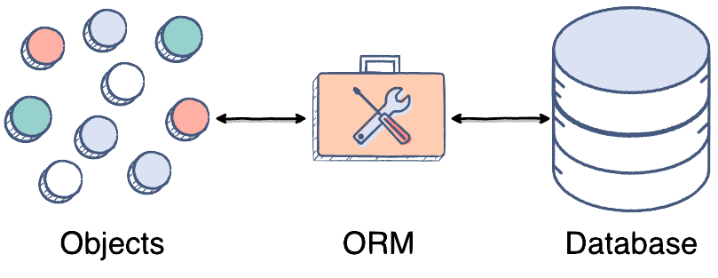

<!-- Para ver esto bonito necesitas este plugin: https://marketplace.visualstudio.com/items?itemName=marp-team.marp-vscode -->

<style>

  img[alt~="center"] {
    display: block;
    margin: auto;
    padding-top: 50px
  }

  img[alt~="logo"] {
    display: block;
    position: absolute;
    right: 20px;
    top: 30px;
  }

  h1, h2, h3 {
    margin: 0 0 0 10px;
    color: #353234;
  }

  p {
    margin: 10px;
  }

</style>


## ORM
### (Object-Relational Mapping)
&nbsp;
Si no quieres complicarte aprendiendo SQL, probablemente deberías saber qué es un :heart: ORM :heart:

---

### Entonces, que es ORM?

Tablas (DB) + ORM  = :star2: Objetos con super poderes (CRUD) :star2:
&nbsp;


---

### Ejemplo

Si tomamos este código de MySQL :sob:

```markdown
＄value = SELECT * FROM collection WHERE day = 'Monday'
```
&nbsp;
Hacemos un poquito de :crystal_ball: magia :crystal_ball: y :confetti_ball:

```markdown
value = collection.query(day = 'Monday')
```
&nbsp;
Mucho mejor :relieved:

---

## ORMs para JS
&nbsp;
**Más populares:** \
Sequelize, followers 271k (Julio, 2010)
Knex.js: SQL Query Builder, followers 158.6k (Diciembre, 2012)
&nbsp;
**En la mira:** \
Prisma, followers 5.7k :arrow_up: (Abril 2019)
&nbsp;
###### Una referencia: https://www.sitepoint.com/javascript-typescript-orms/
---

## :computer: Mejor un ejercicio
&nbsp;
**Usando para Frontend:** React, Chakra, Apollo (buenísimo :heart:).
**Y para Backend:** Babel, Nodemon, Prisma, GraphQL Yoga (GraphQL otro que vale la pena :heart:)
&nbsp;
Enfoque: https://www.prisma.io/
Repo: https://github.com/XixeBombilla/laprevia

---

## Muchas gracias :pray:
### Preguntas :question: